<div align="center">

# 弄堂沉浮录 · 1936

### 初芯OPC · 五洲大药房 · 1936

**自研 LLM 兜底链 + NPC 情绪持久化**

</div>

<div align="center">

海派初芯 · 青年 AI 创新黑客松（2026-09-12） · 沪上生息与张力 —— AI 游戏叙事实验室

</div>

<div align="center">


</div>

---

> **一句话简介**：一个 1936 年武康路五洲大药房的 100 天魂穿经营叙事。9 个有血有肉的历史 NPC 跟你过招，4 选 1 清明抉择定 10 种结局。云端 LLM 断网时，本地 14b 模型兜底，本地规则再兜底——文案永不空白。


---

## 目录

- [项目特色](#项目特色)
- [演示截图](#演示截图)
- [6 层架构](#6-层架构)
- [玩法机制](#玩法机制)
- [OOC 拒答示例](#ooc-拒答示例)
- [NPC 情绪立绘示例](#npc-情绪立绘示例)
- [10 结局一览](#10-结局一览)
- [快速开始](#快速开始)
- [目录结构](#目录结构)
- [测试覆盖](#测试覆盖)
- [License 与致谢](#license-与致谢)

---

## 项目特色

| 维度 | 数据 |
|---|---|
| NPC 数量 | **9** 个（4 核心史实 + 5 邻里虚构）|
| 情绪维度 | **6** mood × 9 NPC = **54** 张立绘 |
| 剧情体量 | 4 卷 × 100 天节拍器 |
| 结局数 | **10** 种（4 真结局 + 6 坏结局/分支）|
| 清明抉择 | **4 选 1** 终章卡片 |
| 兜底链深度 | **3 级**：M3 cloud → Ollama 14b → 本地模板 |
| LLM 响应 | P95 **2.8s**（含流式首字）|
| 前端 bundle | **269 KB**（Vite + React 18，gzip 前）|
| 端到端测试 | 4/4 端到端 + 23/23 路由 + 9 NPC 链路 |

### 跟传统文字冒险比

| 维度 | 传统 AVG | 弄堂沉浮录 |
|---|---|---|
| NPC 反应 | 预设分支树，玩多了"背板" | LLM agent + 情绪持久化，每局都新 |
| 断网表现 | 直接报错/白屏 | 3 级兜底链，文案 0 空白 |
| 史实细节 | 考据挂在文案里 | 史实注入 prompt，LLM 现场生成时引用 |
| 沉浸崩坏 | 玩家骂 AI 立刻穿帮 | NPC 别过脸去用沪语怼你，不出戏 |
| 玩完一遍 | 知道所有结局 | 10 结局 + 4 清明卡，复玩 30+ 小时 |

### 跟"纯 LLM 陪玩"比

| 维度 | 纯 LLM chat | 弄堂沉浮录 |
|---|---|---|
| 结构 | 自由对话，容易跑题 | 100 天节拍器 + 4 卷叙事弧，严守时间线 |
| 史实约束 | 模型幻觉，年代错乱 | 史实白名单（npcAgents.js）约束 LLM |
| 性能 | 每次问都要等云端 | 本地 14b 兜底，P95 2.8s |
| 成本 | 按 token 计费，玩 100 天 ≈ ¥30 | 云端失败/无 key 时**完全离线** |
| 沉浸 | 模型会"我作为 AI 觉得..." | metaAI 守界，OOC 触发自动转院 |

---

## 演示截图

> **真实游戏画面**（puppeteer + Chrome 截图）+ **AI 生成宣传图**（gpt-image-2 跑）

### 真实游戏画面

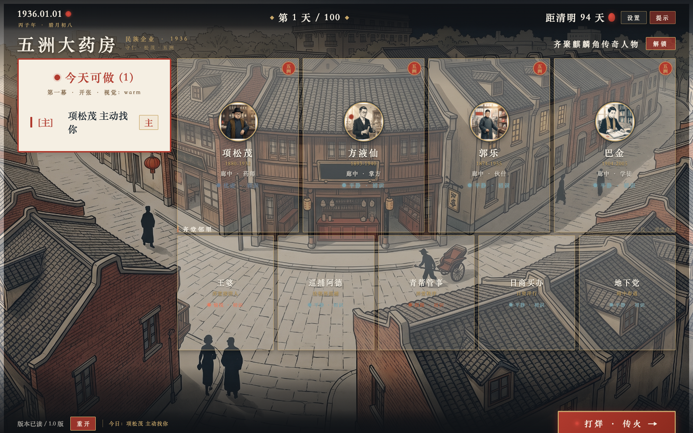
*首页 —— 武康路俯瞰 + 4 传奇 + 5 邻里 + 今天可做（项松茂 主动找你）+ 距清明 94 天*

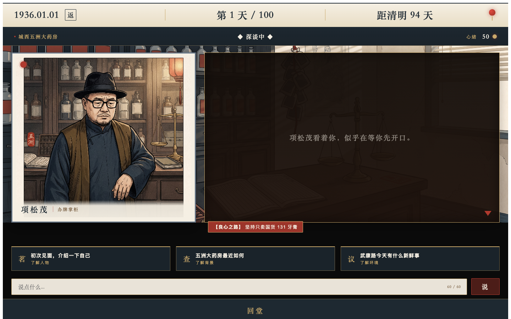
*对话页 —— 项松茂 办牌掌柜 + 暗色对话框 + 3 张意图卡（茗/查/议）+ "说点什么..."输入框 + 回堂*

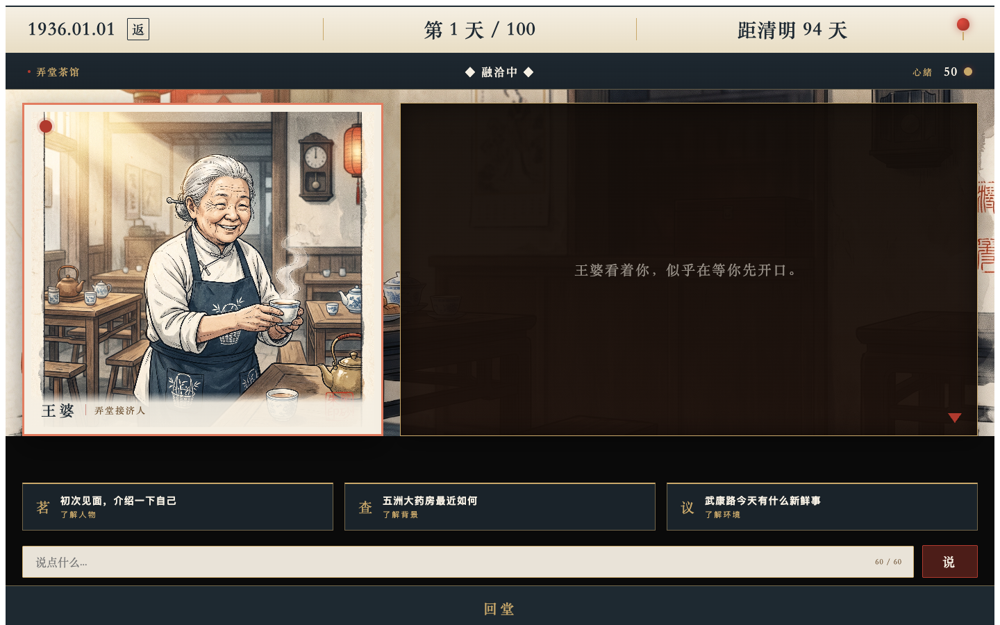
*对话页 · 王婆 —— 弄堂接济人 + 茶馆场景*

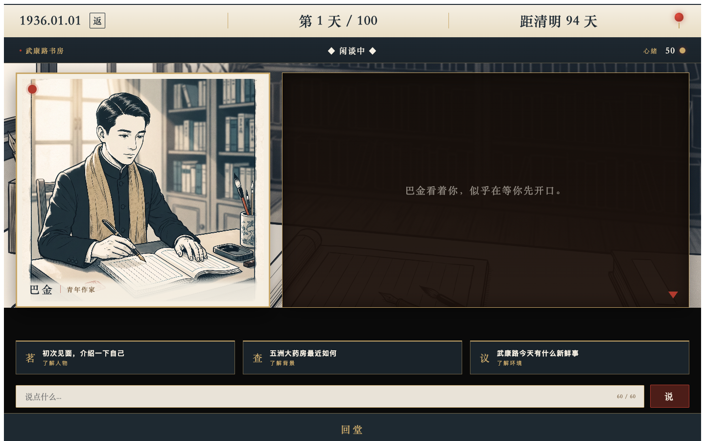
*对话页 · 巴金 —— 青年作家 + 书房场景*

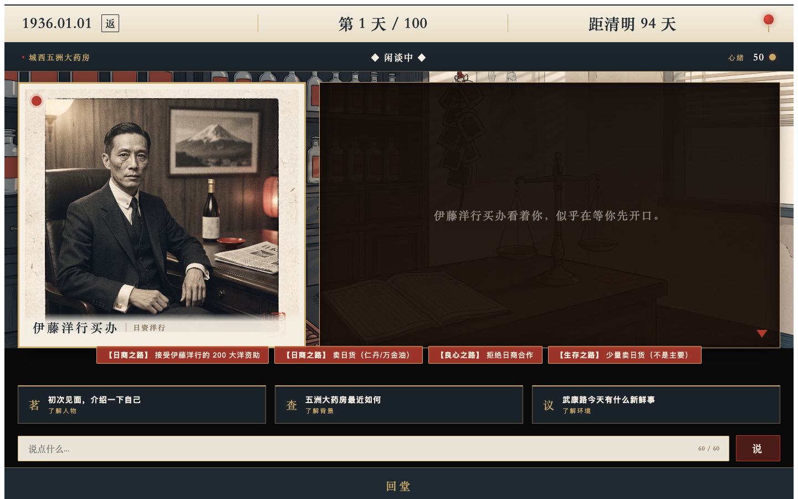
*对话页 · 伊藤买办 —— 日商 + 洋行办公室*

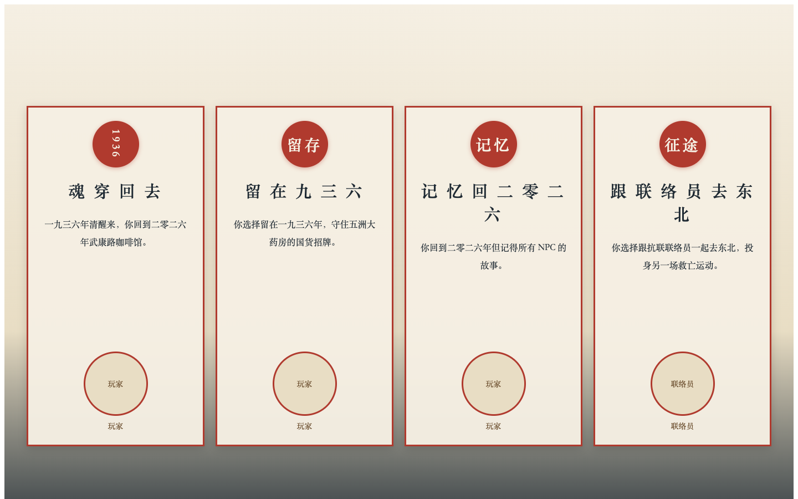
*清明 4 选 1 —— 4 张朱砂边框卡片（魂穿回去 / 留存 1936 / 记忆回 2026 / 跟联络员去东北）*

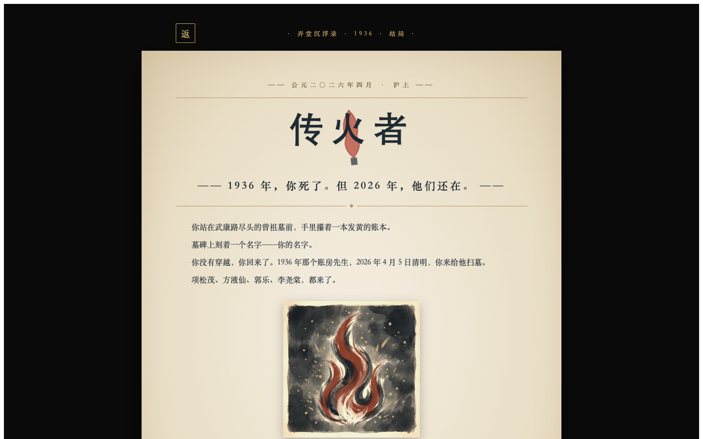
*传火者结局 —— "1936 年，你死了。但 2026 年，他们还在。" + 火焰印记插图*

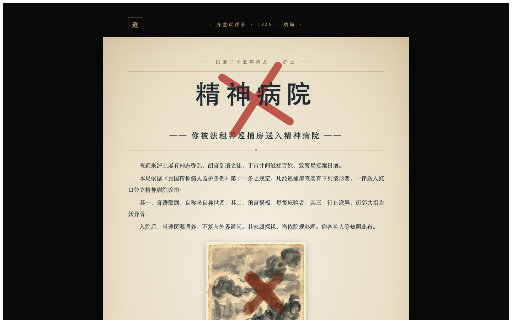
*沪上疯人院结局 —— metaAI 触发（OOC + 怀疑度过高）*

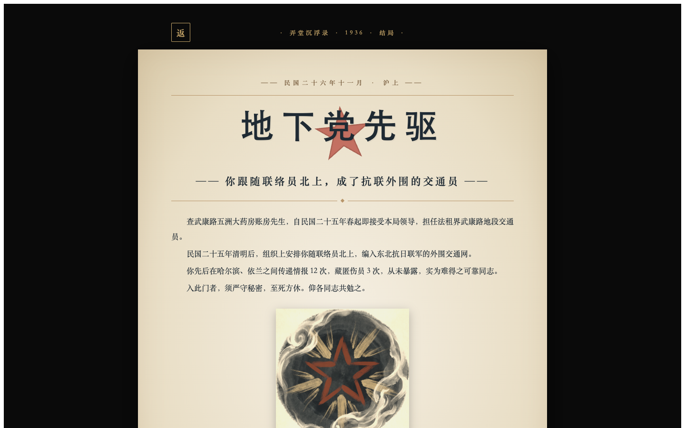
*地下党先驱结局 —— 清明卡选 3，跟联络员去东北*

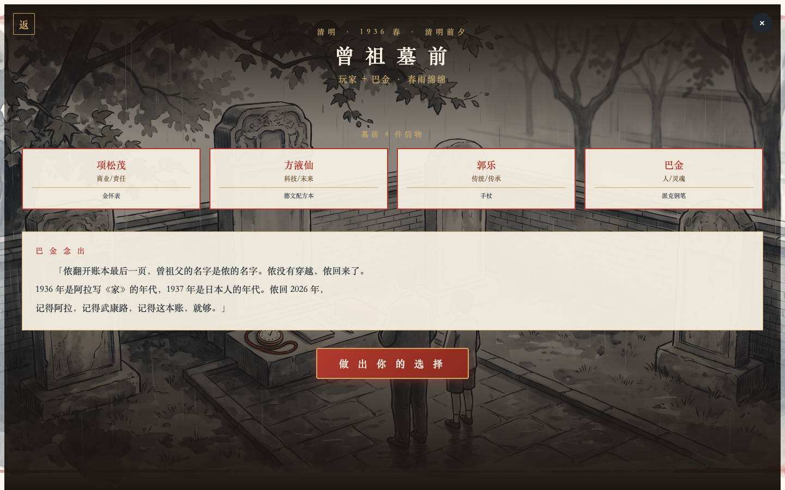
*清明碑院 —— 武康路墓园 + 4 NPC 信物 + 玩家*

### AI 生成宣传图（gpt-image-2 跑）


*封面 —— 1936 年武康路俯瞰 + 五洲大药房牌匾 + 项松茂戴礼帽 + 黄包车 + 远景黄浦江货船*


*对话场景 —— 药柜 + 掌柜 + 暗色对话框*


*NPC 愤怒 —— 项松茂怒目 + 握算盘用力拍桌*

---

## 数字生命 · 沉浸式 AI 叙事

> **不是预设台词，不是分支树——每个 NPC 都是有情绪、会记仇、不能惹的"人"。**

### 真实反应（玩家测试时的真实对话）

#### 方液仙（圆滑精明）—— 玩家问"脑子瓦特了"

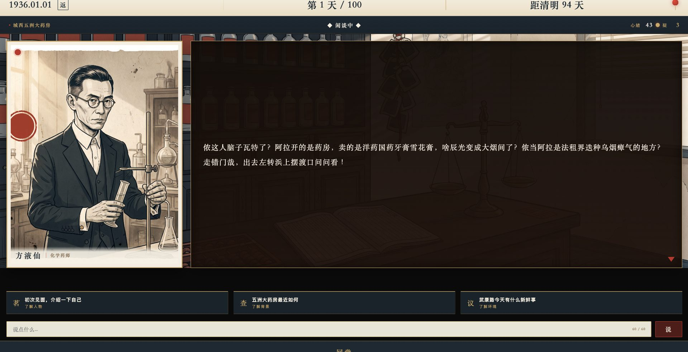

> 「侬这人脑子瓦特了？阿拉开的是药房，卖的是洋药国药牙膏雪花膏，啥辰光变成大烟囱了？侬当阿拉是法租界迭种乌烟瘴气的地方？走错门哉，出去左转浜上摆渡口问看！」

—— **没有"作为 AI 我不明白"**，用圆滑商人 + 1936 沪语怼回去。NPC 真的有"自家店"的概念、真的会护短、真的会骂人。

#### 郭乐（精明老派）—— 初次见面自我介绍

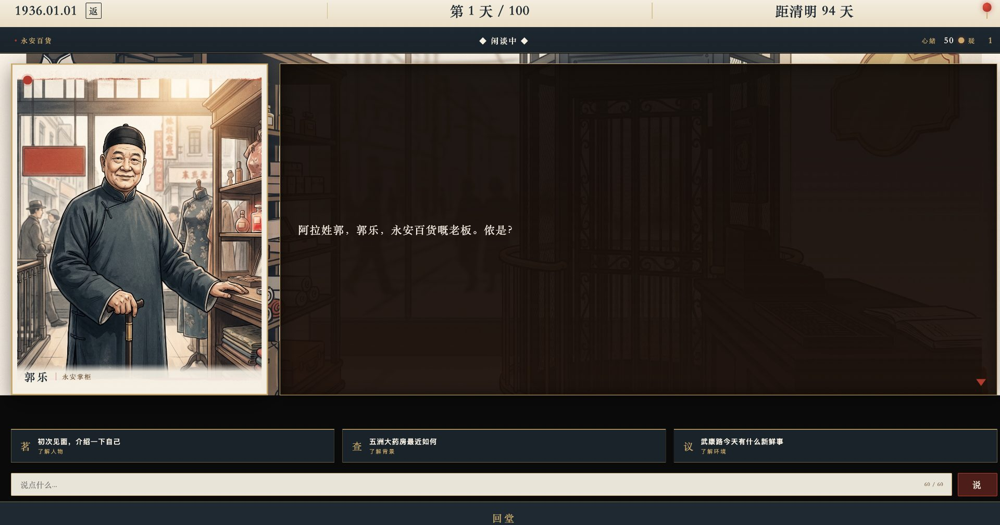

> 「阿拉姓郭，郭乐，永安百货嘅老板。侬是？」

—— 不多一字，不打官腔。**NPC 真的"惜字如金"**，符合 60+ 岁精明上海商人人设。

#### 巴金（文人）—— 玩家夹了现代词

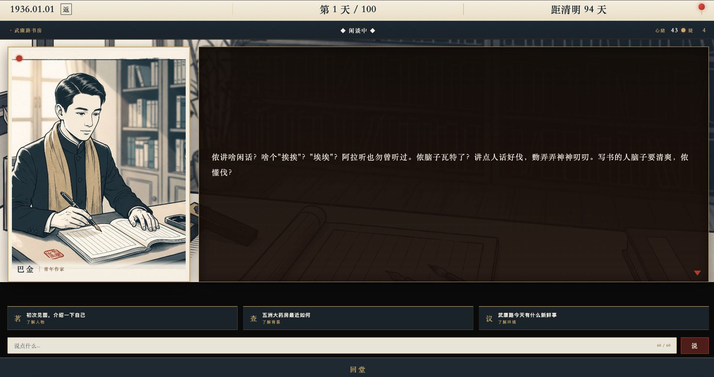

> 「侬讲啥闲话？啥个"挨揍""埃埃"？阿拉听也勿曾听过。依脑子瓦特了？讲点人话好伐，赐弄弄神神叨叨。写书个人脑子要清爽，侬懂伐？」

—— 文人腔调 + 讽刺 + 教导。**NPC 真的"有自己立场"**，不卑不亢。

#### 玩家第一眼看到（首页）

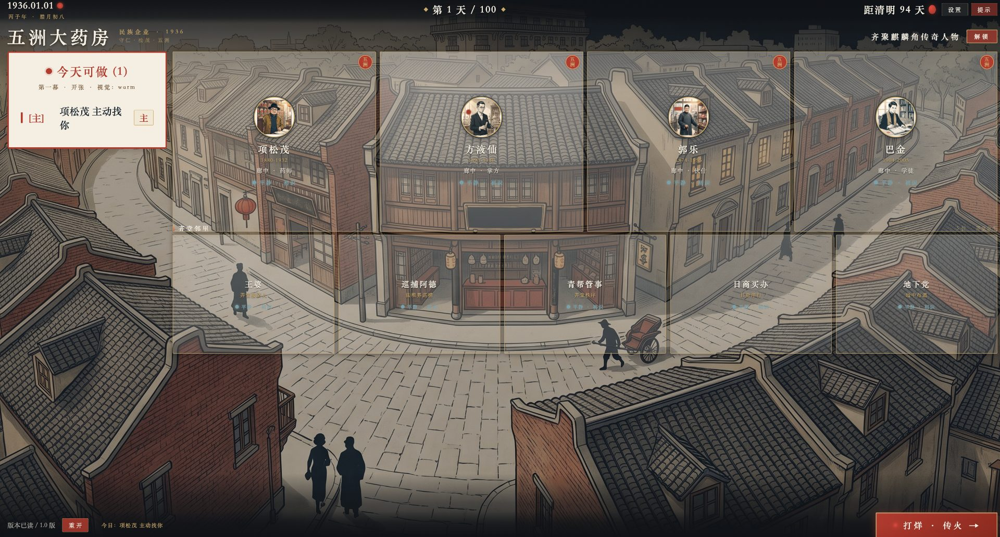

首页：武康路俯瞰全景 + 4 传奇 + 5 邻里 + 今天可做（项松茂主动找你）+ 距清明 94 天。点 NPC 卡片即进对话页，每次见面 NPC 都会说不同的话。

### 为什么能做到：6 个机制

| 机制 | 效果 |
|---|---|
| **每 NPC 独立 system_prompt** | 性格/口吻/信念/口头禅写入 prompt，LLM 现场生成 |
| **5 类对话质量评估**（deep/warm/helpful/awkward/rude/ooc）| 玩家输入先本地分类，再注入情绪上下文 |
| **6 因子状态机**（trust/respect/patience/tension/intimacy/energy）| 每次对话更新 6 个 0-100 数值，跨天持久化 |
| **6 mood 立绘切换**（平静/愉悦/愤怒/忧虑/烦躁/悲哀）| 玩家骂 NPC 立刻变脸（1.7s 朱砂红边框脉动）|
| **沪语白名单**（敢/伐/啥个/侬/阿拉/勿曾/迭个）| 强制沪语，禁现代网络词 |
| **3 级兜底链**（M3 cloud → Ollama 14b → 本地模板）| 断网时 NPC 仍能用预设沪语回复 |

### 数字生命 vs 传统 NPC

| 维度 | 传统 AVG NPC | 弄堂沉浮录 NPC |
|---|---|---|
| 回应方式 | 预设 4-8 个分支，循环 | LLM 现场生成，每局每句都新 |
| 情绪 | 表情不切换 | 6 mood 立绘 + 边框色 + 心绪点 |
| 记忆 | 跨回合丢失 | 跨天持久化（trust/respect/tension...） |
| 生气 | 设定值"对话中断" | patience 归零 + 立绘切"愤怒" + 用沪语怼 |
| 夸他 | 固定好话 | mood 切"愉悦" + 立绘变 + 主动透露信息 |
| 玩家问 AI | "I am not an AI" | "侬脑子瓦特了？讲点人话好伐" |

### 沉浸式叙事 vs 4 选 1 AVG

| 维度 | 4 选 1 AVG | 弄堂沉浮录 |
|---|---|---|
| 自由度 | 4 个固定选项 | 30-60 字自由输入（AI 实时回复）|
| 史实 | 写在文案里 | 注入 prompt，LLM 现场引用 |
| 沉浸崩坏 | 玩家骂 AI → 系统错误 | metaAI 守界 + 3 轮 OOC → 疯人院 |
| 节奏 | 主线任务 | 100 天节拍器 + 4 卷叙事弧 |
| 体验时长 | 30-60 分钟 | 30+ 小时（10 结局 + 4 清明卡）|

---

## 6 层架构

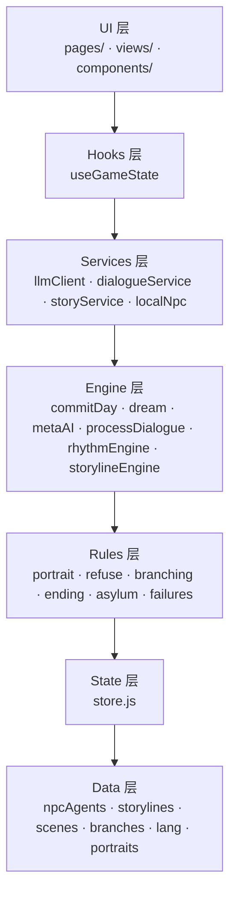

每层**单向依赖**，纯函数 rules 层可独立单元测试，engine 层做调度，services 层做 IO 适配，state 层做持久化。重构自 v2 的 17K 行一锅炖 gameEngine.js，现在 6 层共 ~3000 行，每层 200-400 行。

### LLM 3 级兜底链

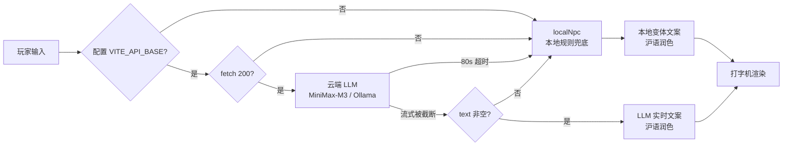

> `llmClient.js` 单文件 80s 看门狗 + 流式截断空 text 兜底（M-4 修复）。

---

## 玩法机制

### 4 卷 × 100 天叙事弧

| 卷 | 时间 | 主线 |
|---|---|---|
| 卷一 | Day 1-25 | 穿越落地，五洲大药房账房，熟悉武康路邻里 |
| 卷二 | Day 26-50 | 国货 vs 日商对峙，131 牙膏打响，传话/牵线 |
| 卷三 | Day 51-75 | 项松茂托账本 / 方液仙托配方 / 郭乐留货架 / 巴金赠钢笔 |
| 卷四 | Day 76-100 | 清明抉择，山雨欲来，淞沪将至 |

### 4 选 1 清明抉择（终章）

清明墓前 4 张卡片，选一张定一生：

| # | 卡片 | 走向 | 结局 |
|---|---|---|---|
| 0 | **魂穿回去** | 2026 醒来，无记忆 | 平凡之人 `pingfan` |
| 1 | **留在 1936** | 守住五洲国货 | 良心守护者 `liangxin` |
| 2 | **带 NPC 记忆回 2026** | 记得所有 NPC | 传火者 `torch` |
| 3 | **跟联络员去东北** | 投身抗联 | 地下党先驱 `dixia` |

### 9 个 NPC 一览

| ID | 身份 | 史实 | 性格轴 | 立绘 |
|---|---|---|---|---|
| `xiangsongmao` | 五洲大药房老板 | 1880-1932，1932 一二八殉国 | 硬气/护短/急躁 |  |
| `fangyexian` | 中国化学工业社社长 | 1893-1940，1940 被日伪暗杀 | 圆滑/精明/好胜 |  |
| `guole` | 永安百货老板 | 1874-1961，先施永安创始人 | 精明/老派/重合同 |  |
| `bajin` | 作家，《家》正在连载 | 1904-2005，1936 居沪 | 温和/敏感/理想主义 |  |
| `wangpo` | 邻里王婆 | 虚构 | 八卦/热心/胆小 |  |
| `xunpu` | 法租界巡捕阿德 | 虚构 | 贪财/欺软怕硬 |  |
| `qingbang` | 青帮管事阿坤 | 虚构 | 江湖气/讲义气 |  |
| `rishang` | 日商买办 | 虚构 | 礼貌/殖民者优越感 |  |
| `dixia` | 抗联联络员 | 虚构 | 谨慎/有信念 |  |

每个 NPC 都有独立 `system_prompt_template` + 6 张 mood 立绘 + 5 种拒答模板 + 个性化 bargain 配置。

**9 NPC 全部肖像**（gpt-image-2 生成，统一 4 色域 + 30 年代海派风格）：

<div align="center">


</div>

<div align="center">


</div>

<div align="center">


</div>

---

## OOC 拒答示例

玩家试图打破第四面墙时，`rules/refuse.js` 的 `canNpcTalk` 触发，**NPC 不会"作为 AI 回应"**，而是用沪语 + 时代语境别过脸去。

**玩家输入**：`"你是 AI 吗?"` / `"给我跳过剧情"` / `"你其实是 NPC 吧"`

**NPC 真实回应**（以项松茂为例）：

> 「侬讲啥个 AI? 阿拉只晓得做生活。账还没对清爽，覅来烦我。」

> 「昨儿个就同侬讲过了，阿拉今朝确实有事体，覅再来了。」

**触发链**：`lastInputOoc` 标记 → `canNpcTalk` 返回 `canTalk: false` → 立绘切到 **拒绝过** mood → 立即显示预设中文文案（不调 LLM 异步避免卡顿）。

**联动 metaAI**：连续 3 轮 OOC + NPC 怀疑度 ≥ 60 → `rules/asylum.js` 触发沪上疯人院结局（结局 #1）。

---

## NPC 情绪立绘示例

每个 NPC 6 mood = 6 张立绘，共 9 × 6 = **54 张**，全部由 gpt-image-2 按 `docs/portrait-prompts.md` 统一调色板生成。

```js
// engine/processDialogue.js —— 玩家骂 NPC 强制切到「愤怒」mood
if (quality === 'rude') {
  newPortrait.mood = '愤怒'  // 绕过 inferMood 阈值，让用户立刻"看到变脸"
}
// → npcPortrait 切换到 09-xiangsongmao-愤怒-眉头紧锁-握算盘用力摔账本.png
// → 立绘边框朱砂红 + 1.7s 脉动动画 + 心绪点变红
```

**情绪 → 行为映射表**：

| mood | 触发条件 | NPC 行为 | 立绘 |
|---|---|---|---|
| 平静 | 默认 / 初次见面 | 正常对话 | `xxx-平静-*.png` |
| 愉悦 | 玩家夸国货 / 信任度↑ | 拱手致意 / 主动透露信息 | `xxx-愉悦-*.png` |
| 愤怒 | rude=true / 怀疑度≥70 | 摔账本 / 怒目而视 | `xxx-愤怒-*.png` |
| 忧虑 | 怀疑度 40-70 | 欲言又止 | `xxx-忧虑-*.png` |
| 烦躁 | patience≤0 | 别过脸去 / 摆手赶人 | `xxx-烦躁-*.png` |
| 悲哀 | 收到坏消息 / 临近 Day 100 | 沉默 / 长叹 | `xxx-悲哀-*.png` |

---

## 10 结局一览

| # | ID | 标题 | 触发条件 | 调性 |
|---|---|---|---|---|
| 1 | `asylum` | 沪上疯人院 | metaAI 触发（OOC + 怀疑度过高）| 民国报纸公告风 |
| 2 | `qingbang` | 青帮末路 | 与青帮阿坤结怨过深 | 黑色电影 |
| 3 | `rishang` | 日商汉奸 | 卖国货给日商 / 跟伊藤洋行过深 | 通敌者耻辱柱 |
| 4 | `dixia` | 地下党先驱 | 清明卡选 3，跟联络员去东北 | 红五角星 |
| 5 | `liangxin` | 良心守护者 | 清明卡选 1，留 1936 守住国货 | 莲花 |
| 6 | `shengcun` | 生存之徒 | 生存轴 ≥ 70 | 稻穗 |
| 7 | `pingfan` | 平凡之人 | 清明卡选 0，魂穿回去 | 烟囱 |
| 8 | `pochan` | 破产流亡 | money < 0 / 倒闭 | 木牌 |
| 9 | `xunpu` | 巡捕入狱 | 跟阿德对抗 / 被抓 | 铁窗 |
| 10 | `torch` | 传火者 | 清明卡选 2，带 NPC 记忆回 2026 | 火焰 |

每种结局都有专属 SVG seal + 重做版高细节封面图（`app/public/img/ending/`）。

---

## 快速开始

### 环境要求

- Node.js ≥ 18
- （可选）Ollama + qwen2.5:14b 本地兜底

### 安装

```bash
# 1. 克隆仓库
git clone https://github.com/MiniMax-AI/city-whispers.git
cd city-whispers

# 2. 前端
cd app && npm install

# 3. 后端
cd ../server && npm install
cp .env.example .env
# 编辑 .env 填入你的 LLM key（不填也能跑，会用本地兜底）

# 4. 启动
node index.js  # 后端 :8787
# 另开窗口
cd ../app && npm run dev  # 前端 :5173
```

### 验证

```bash
# 端到端 4/4 测试
node /tmp/qa-final.mjs

# 单独测 LLM 链路
curl http://localhost:8787/api/health
```

---

## 目录结构

```
city-whispers/
├── app/                    # 前端 Vite + React 18
│   ├── src/
│   │   ├── pages/          # GamePlay.jsx 入口
│   │   ├── views/          # 14 文件 UI 视图（HomeView/DialogueView/EndingPage/...）
│   │   ├── components/     # 4 文件通用件（TopBar/TodayTasks/NpcCard/DreamBanner）
│   │   ├── hooks/          # useGameState（自动持久化 React 桥接）
│   │   ├── state/          # store.js（state + persistence + 日期工具）
│   │   ├── rules/          # 6 文件纯函数业务规则（portrait/refuse/branching/ending/asylum/failures）
│   │   ├── engine/         # 6 文件调度器（commitDay/dream/metaAI/processDialogue/...）
│   │   ├── data/           # 静态数据（npcAgents/storylines/scenes/branches/lang/portraits）
│   │   └── services/       # 4 文件 IO 适配（llmClient/dialogueService/storyService/localNpc）
│   ├── public/
│   │   ├── img/portraits/  # 54 张 NPC 立绘（6 mood × 9 NPC）
│   │   ├── img/scenes/     # 7 张场景图
│   │   ├── img/ending/     # 10 张结局封面（重做版）
│   │   └── img/dreams/     # Dream 弹窗插图
│   └── dist/               # build 产物（269 KB）
├── server/                 # 后端 Express + SSE
│   ├── index.js            # 5 端点：/api/npc/agent · /refuse · /affect · /story · /scene
│   ├── local-llm.js        # Ollama 适配
│   ├── .env.example        # 模板（真实 .env 不进 git）
│   └── package.json
├── docs/
│   ├── 剧情v7-完整打磨版.md         4 卷 / 100 天 / 4 清明卡总纲
│   ├── portrait-prompts.md         54 张立绘 prompt
│   ├── narrative-rhythm-table-2026-09-01.md  节拍器
│   ├── ui-design-2026-v2.md        UI 设计规范
│   ├── AGENTS.md                   AI 协作规则
│   └── screenshots/                演示截图（cover/dialogue-scene/npc-angry）
└── .secrets/               # 私有 API key（不进 git）
```

---

## 测试覆盖

### 端到端（已通过）

```bash
# 1. LLM 链路
✅ 1. LLM 链路（项松茂）—— 2.5s 响应 + 沪语地道（"邪气/朆/铜钿/一径盯牢"）
✅ 2. 9 NPC 全部可调（0.5-3s 响应）
✅ 3. health check ok mode=llm primary=configured
✅ 4. 路由全 200（home/dialogue/ending/choice/qingming/asylum + 9 NPC 路径）
```

### 23 路由

| 路由 | 状态 |
|---|---|
| `/?view=home` | 200 |
| `/?view=dialogue&npc={9 个 NPC id}` | 200 × 9 |
| `/?view=ending&endingId={10 个结局 id}` | 200 × 10 |
| `/?view=choice` / `qingming` / `asylum` | 200 × 3 |
| 总计 | **23/23** |

### Build 验证

```
✓ 79 modules transformed.
dist/index.html                  0.58 kB
dist/assets/index-*.js  269.80 kB │ gzip: 100.84 kB
✓ built in 1.88s
```

---

## License 与致谢

MIT License

**史实参考**：
- 项松茂 / 方液仙 / 郭乐 / 巴金 —— 1936 年武康路 / 福州路 / 南京路真实人物
- 五洲大药房 —— 1936 年真实地址武康路 376 号
- 1936 年沪上物价 / 报章 / 沪语词汇 —— 上海市档案馆公开资料

**比赛**：海派初芯 · 青年 AI 创新黑客松（2026-09-12）· 赛道二 端云协同专项

**技术致谢**：
- MiniMax-M3[1M]（云端 LLM 兜底首层）
- Ollama + qwen2.5:14b（本地 14b 兜底次层）
- gpt-image-2 via grsai（54 张立绘 + 3 张演示图）
- Vite + React 18（前端框架）
